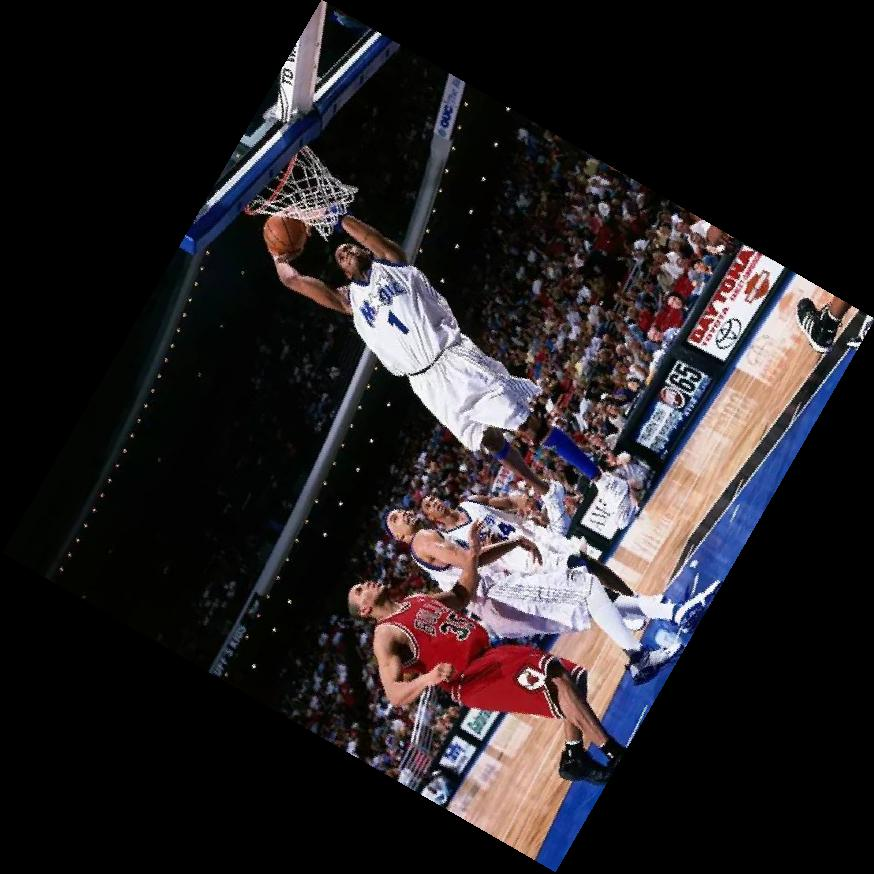

# Chan-Wei Hu(胡展維) <span style="color:red">(102061247)</span>

# Project 0 / Image Flipping and Rotation

## Overview
The project is related to 
> basic image flipping and rotation


## Implementation
1. flip.m
	* Simply do pixel flipping(left to right or up to down), then we can get a flipped image. Take flip left and right for example:
	    
	    ```
	    for h = 1 : height
               for w = 1 : width 
            	   R_flip(h, w) = R(h, width - w + 1);
                   G_flip(h, w) = G(h, width - w + 1);
                   B_flip(h, w) = B(h, width - w + 1);
               end
        end
	    ```
	    
2. rotation.m
	* It's more complicated than flipping. First, we need to estimate the required size after rotation, so we need to record the vertex of original image and then map to vertex_new via rotation matrix, and find its max, min points.As following:
	
	        
	        matrix = [cos(radius) -sin(radius) ; sin(radius) cos(radius)];
	        vertex = [1 1; width 1; 1 height; width height];
            vertex_new = (vertex * matrix)';    
	        min_x = min(vertex_new(1,:));
	        max_x = max(vertex_new(1,:));
	        min_y = min(vertex_new(2,:));
	        max_y = max(vertex_new(2,:));
        	
	
   	* Next we consider how much we should shift to positive axis, then do back-warping using bilinear interpolation. As following process(see rotation.m for more details):
	
	
	
	
## Installation
* Only required MatLab
		
## My Results
* Flipping

<table border=1>
		<tr>
		<td>
		
		
		
		
		</td>
		</tr>

		<tr>
		<td>
		
		
		
		
		</td>
		</tr>

</table>


* Rotation

<table border=1>

<tr>
<td align="center">
<b> Original Image</b>
</td>
<td align="center">
<b> Rotate 60 degree<b/>
</td>
<td align="center">
<b> Rotate 180 degree<b/>
</td>
</tr>

<tr>
<td>
</td>
<td>
</td>
<td>

</td>
</tr>

<tr>
<td>
</td>
<td>
</td>
<td>

</td>
</tr>
</table>
