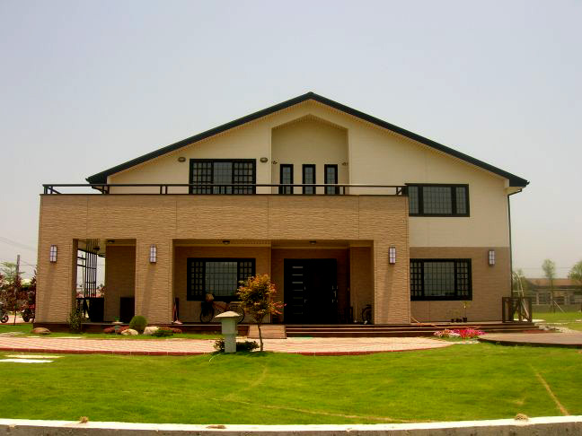

# Chan-Wei Hu(胡展維)(102061247)

# Homework 2 / Corner Detection

## Overview
The project is related to `Image Gradient, Image filtering, Corner Detection`! 
> In this project, we would like to detect the corner of the selected image, there are lots of algorithms to detect the corner, but it's very good to filter noise using Harris Corner Detector method, so we try to implement in this homework.

## Implementation
1. First, we should convert the color image to grey scale, as below code:
        
                grey_image = zeros(size(I,1), size(I,2));
                for i = 1:size(I,1)
            	    for j = 1:size(I,2)
                        grey_image(i, j) = 0.299*I(i,j,1) + 0.587*I(i,j,2) + 0.114*I(i,j,3);
                    end    
                end

2. Then we filter the grey image with "gradient filter" and get the Harris matrix, as below code(take only Ixy for example):

                Ixy = zeros(size(Ix));
                for i=1:size(Ix,1)
                    for j=1:size(Ix,2)
                        Ixy(i,j) = Ix(i,j)*Iy(i,j);
                    end
                end
                Ixy = imfilter(Ixy, g, 'same');
                
3. Then we need to measure the corner response using R=dat(A)-alpha*(trace(A)^2), where A is Harris matrix. As following code:

                M = zeros(2,2);
                R = zeros(size(grey_image));
                for i=1:xmax
                    for j=1:ymax
                        M = [Ix2(i,j) Ixy(i,j); Ixy(i,j) Iy2(i,j)];
                        R(i,j) = det(M) - alpha * (trace(M)^2);
                    end
                end
		
4. Next I use "ordfilt2()" function to find where is the local maximum that bigger than threshold, and finally find RBinary , which is the matrix only consist 0(not corner) and 1(corner), as following code:

                sze = 2*r+1; % domain width
                MX = ordfilt2(R ,sze^2, ones(sze));
		RBinary = (R==MX)&(R>Thrshold);
		

5. Harris corner derivation:

6. I totally follow the procedure on TA's slide:

## Installation
* Clone the code to local, and execute with MatLab.

## My Results

<table border=1>

<tr>
<td align="center">
<b> Original Image</b>
</td>
<td align="center">
<b> Ixy<b/>
</td>
<td align="center">
<b> Corner Detection<b/>
</td>
</tr>

<tr>
<td>

</td>
<td>

</td>
<td>

</td>
</tr>

<tr>
<td>

</td>
<td>

</td>
<td>

</td>
</tr>

<tr>
<td>

</td>
<td>

</td>
<td>

</td>
</tr>

<tr>
<td>

</td>
<td>

</td>
<td>

</td>
</tr>
</table>

